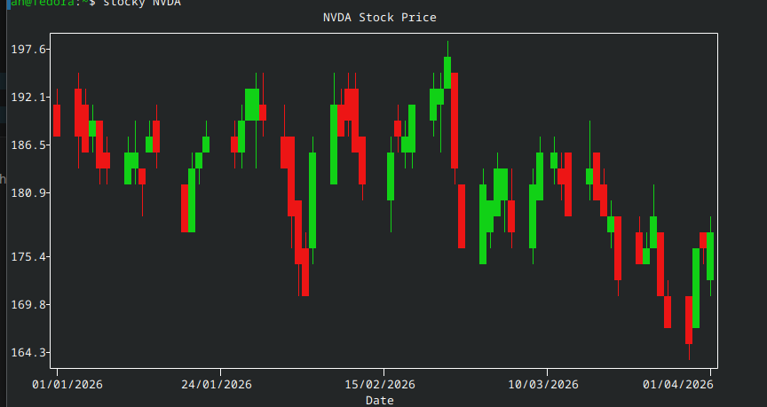

# stocky
A tool that allows you to view stocks straight from your terminal, and utilizes plotext.

Basic syntax:

stocky STOCK_NAME

i.e: stocky NVDA

# Flags:

--start: start time of chart in d/m/y

--end: end time of chart in d/m/y

# To install:

- Copy this repo into any folder (copy the path of the .venv and stocky.py)

# Linux:

- Type "nano ~/.bashrc" into terminal

- At the bottom, add "alias stocky="PATH/TO/.venv PATH/TO/stocky.py"

- Press Ctrl-x, y, enter to save
